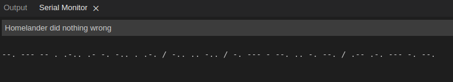
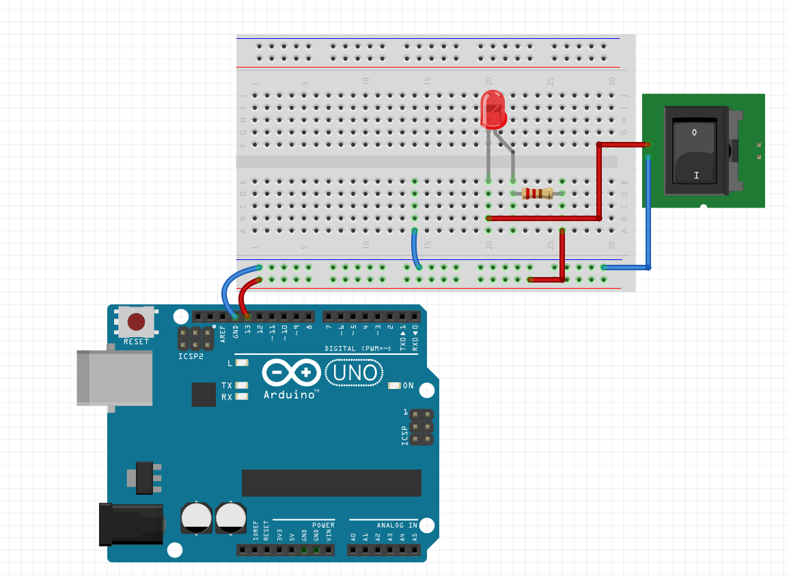

# Arduino: Text to Morse Code

Open the Serial monitor and write some text, it will convert it int Morse
code and make a light blink. I have no idea what else to do.

## Resources:
- [Morse translator](https://morsecode.world/international/translator.html) I found around
- [Morse units explained](https://morsecode.world/international/timing.html) because I don't know Morse code
